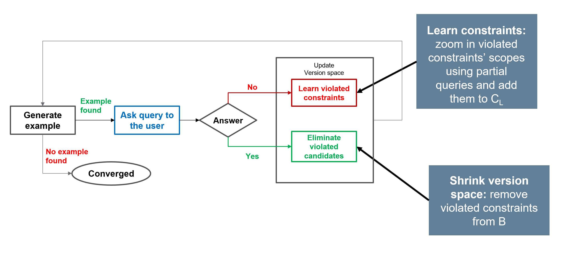

## PyConA: Constraint Acquisition in Python

PyConA ([https://github.com/CPMpy/PyConA](https://github.com/CPMpy/PyConA)) is a python-based, open-source package for Constraint Acquisition (CA). In CA, **the goal is to assist the user in modeling**  Constraint Programming (CP) problems, by learning the constraints through user interaction.

PyConA is based on the powerful CPMpy Constraint Programming and Modeling library in python (https://github.com/CPMpy/cpmpy), which is used for modeling the constraint problems.

Currently, only interactive CA methods are implemented in PyConA; passive CA methods might be added later.

### Interactive Constraint Acquisition



In interactive CA, the system interacts with an Oracle, which can be a human user or a software system. The CA system asks queries and based on the answers of the oracle it either learns or excludes constraints.

PyConA is a generic CA library implementing a range of interactive CA methods, using the following modules:
- Interactive CA Algorithm: The top-level algorithm to be used.
- Query Generation: The query generation system to be used to generate top-level queries.
- FindScope: The FindScope system to be used for finding the scope of violated constraints.
- FindConstraint: The FindConstraint system to be used for finding the exact violated constraints in the given scopes.

A detailed presentation of CA methods can be found at: 
- [Video](https://www.youtube.com/embed/d6EZi8YO60k)
- [Slides](https://school.a4cp.org/summer2023/slides/ml4cp2023_consacq_DimosTsouros.pdf)

### Features

The repository has implemented various approaches and methods from the literature:
- Algorithms: QuAcq [[1](https://www.lirmm.fr/~coletta/pub/ijcai13.pdf)-[2](https://www.sciencedirect.com/science/article/abs/pii/S0004370223000425)], MQuAcq [[3](https://link.springer.com/chapter/10.1007/978-3-319-98334-9_25)-[4](https://link.springer.com/article/10.1007/s10601-020-09311-4)], MQuAcq-2 \[[5](https://link.springer.com/chapter/10.1007/978-3-030-30048-7_41)], GrowAcq \[[6](https://drops.dagstuhl.de/entities/document/10.4230/LIPIcs.CP.2023.36)], P-QuAcq\[[7](https://www.ijcai.org/Proceedings/16/Papers/108.pdf)], G-QuAcq [[8](https://ieeexplore.ieee.org/stamp/stamp.jsp?tp=&arnumber=7372165&tag=1)]
- Query Generation: TQ-Gen [[9](https://link.springer.com/chapter/10.1007/978-3-319-93031-2_1)], PQ-Gen [[6](https://drops.dagstuhl.de/entities/document/10.4230/LIPIcs.CP.2023.36)]
- FindScope: FindScope [[1](https://www.lirmm.fr/~coletta/pub/ijcai13.pdf)], Findscope-2 [[2](https://www.sciencedirect.com/science/article/abs/pii/S0004370223000425), [4](https://link.springer.com/article/10.1007/s10601-020-09311-4)]
- FindC: FindC [[1](https://www.lirmm.fr/~coletta/pub/ijcai13.pdf)], FindC-2 [[2](https://www.sciencedirect.com/science/article/abs/pii/S0004370223000425)]
- ML-based CA system and query generation objectives from [[10](https://ojs.aaai.org/index.php/AAAI/article/download/28655/29272)]

### Installation

#### Clone and Install from this Repo

```python
git clone -b main https://github.com/CPMpy/PyConA.git
```

## Pip install through pip

You can install pycona through pip
```python
pip install pycona
```

### Basics

In **PyConA**, the ProblemInstance class represents the instance of the problem the user wants to acquire the constraints for. It must be initialized with the variables of the problem and a language. 
A CA system is then used to acquire the constraints. A CA system uses a CA environment to configure its options. 
**PyConA** currently implements only interactive CA algorithms (module .active_algorithms).The core of interactive CA systems is the AlgorithmCAInteractive class. This is subclassed with different algorithms presented in the literature.

### Basic Tutorials

- [](https://colab.research.google.com/github/CPMpy/PyConA/blob/main/notebooks/introductory_example.ipynb)**Introductory Example**
- [](https://colab.research.google.com/github/CPMpy/PyConA/blob/main/notebooks/Comparing%20different%20algorithms%20and%20methods.ipynb)**Comparing different algorithms and methods**
- [](https://colab.research.google.com/github/CPMpy/PyConA/blob/main/notebooks/Prediction-based%20CA%20system.ipynb)**Prediction-based CA system**
- [](https://colab.research.google.com/github/CPMpy/PyConA/blob/main/notebooks/Tutorial%20Demo.ipynb)**Tutorial Demo**

### How to Cite PyConA

If you use PyConA in your work, please cite it as follows:

```bibtex
@inproceedings{pycona,
  title={A CPMpy-based Python library for Constraint Acquisition - PyConA},
  author={Tsouros, Dimos and Guns, Tias},
  booktitle={Proc. AAAI 2025 Bridge on Constraint Programming and Machine Learning (CPML)},
  year={2025}
}
```

### Documentation

Coming soon

### References

[1] [Bessiere, C., at al. (2013, June). Constraint acquisition via partial queries. In _Twenty-Third International Joint Conference on Artificial Intelligence.](https://www.lirmm.fr/~coletta/pub/ijcai13.pdf)

[2] [Bessiere, C., et al. (2023). Learning constraints through partial queries. Artificial Intelligence, 319, 103896.](https://www.sciencedirect.com/science/article/abs/pii/S0004370223000425)

[3] [Tsouros, D. C., Stergiou, K., & Sarigiannidis, P. G. (2018). Efficient methods for constraint acquisition. In _Principles and Practice of Constraint Programming: 24th International Conference, CP 2018, Lille, France, August 27-31, 2018, Proceedings 24_ (pp. 373-388). Springer International Publishing.](https://link.springer.com/chapter/10.1007/978-3-319-98334-9_25)

[4] [Tsouros, D. C., & Stergiou, K. (2020). Efficient multiple constraint acquisition. _Constraints_, _25_(3), 180-225.](https://link.springer.com/article/10.1007/s10601-020-09311-4)

[5] [Tsouros, D. C., Stergiou, K., & Bessiere, C. (2019). Structure-driven multiple constraint acquisition. In _Principles and Practice of Constraint Programming: 25th International Conference, CP 2019, Stamford, CT, USA, September 30–October 4, 2019, Proceedings 25_ (pp. 709-725). Springer International Publishing.](https://link.springer.com/chapter/10.1007/978-3-030-30048-7_41)

[6] [Tsouros, D. C., Berden, S., & Guns, T. (2023). Guided Bottom-Up Interactive Constraint Acquisition}}. In _29th International Conference on Principles and Practice of Constraint Programming (CP 2023)_ (Vol. 280, p. 36).](https://drops.dagstuhl.de/entities/document/10.4230/LIPIcs.CP.2023.36)

[7] [Daoudi, A., Mechqrane, Y., Bessiere, C., Lazaar, N., & Bouyakhf, E. H. (2016, July). Constraint Acquisition with Recommendation Queries. In _IJCAI_ (pp. 720-726).](https://www.ijcai.org/Proceedings/16/Papers/108.pdf)

[8] [Daoudi, A., Lazaar, N., Mechqrane, Y., Bessiere, C., & Bouyakhf, E. H. (2015, November). Detecting types of variables for generalization in constraint acquisition. In _2015 IEEE 27th International Conference on Tools with Artificial Intelligence (ICTAI)_ (pp. 413-420). IEEE.](https://ieeexplore.ieee.org/stamp/stamp.jsp?tp=&arnumber=7372165&tag=1)

[9][Ait Addi, H., Bessiere, C., Ezzahir, R., & Lazaar, N. (2018). Time-bounded query generator for constraint acquisition. In _Integration of Constraint Programming, Artificial Intelligence, and Operations Research: 15th International Conference, CPAIOR 2018, Delft, The Netherlands, June 26–29, 2018, Proceedings 15_ (pp. 1-17). Springer International Publishing.](https://link.springer.com/chapter/10.1007/978-3-319-93031-2_1)

[10] [Tsouros, D., Berden, S., & Guns, T. (2024, March). Learning to learn in interactive constraint acquisition. In _Proceedings of the AAAI Conference on Artificial Intelligence_ (Vol. 38, No. 8, pp. 8154-8162)](https://ojs.aaai.org/index.php/AAAI/article/download/28655/29272)
